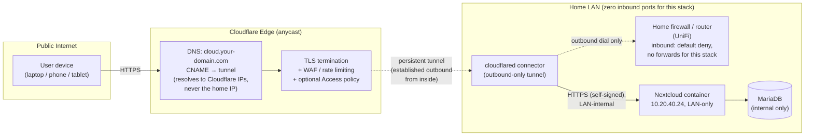

# Self-Hosted Nextcloud, Publicly Reachable, With Zero Open Inbound Ports

Exposing a self-hosted file/collaboration server to the public internet **without forwarding a single port** on the home firewall, using a Cloudflare Tunnel as the only ingress path.

> **Note on this repo:** This is the public version of a system I actually run at home. Domains, addresses, tokens, and passwords have been swapped for placeholders (`your-domain.com`, `10.20.0.0/16`, `<REDACTED>`); the architecture, the decisions, and the trade-offs are the real thing. The single squashed commit is deliberate: the write-up was scrubbed from a private working copy before it went public.

---

## Problem

I wanted my own files, calendar, and contacts, synced across a laptop, an iPhone, and an iPad, without renting that capability from a third-party cloud. Self-hosting Nextcloud solves the "whose computer is my data on" question. It creates a new one: how do I reach it from anywhere without turning my home network into an attack surface?

My first plan was to not expose it at all: keep it reachable only over the Tailscale mesh I already use for administration. For a single user that's the right answer, and it's still how everything admin-flavored works here. What broke it was sharing. Half the point of running your own file platform is sending someone a folder, or giving a collaborator a link where they can upload files to you, and you can't ask every one of those people to install a VPN client first. So the requirement became: public reachability, for exactly one application, with a stranger's browser as the client. Everything below is what that requirement forced.

The default playbook for exposing a home service is to forward a port (usually 443) on the router straight to the box running the app. That works. It's also how a lot of home labs end up on Shodan. Forwarding a port means:

- The service is now directly reachable by anyone who scans the IP, including the bots that probe around the clock for unpatched Nextcloud, weak passwords, and known CVEs.
- My home IP address is publicly tied to a named service. DNS for `cloud.your-domain.com` points an A record straight at where I live.
- I'm responsible for terminating TLS, rotating certificates, and absorbing every malicious request before it's filtered. The bad traffic reaches my hardware first, then gets rejected.
- A misconfiguration (an accidentally-open admin port, a stale firewall rule) fails *open*: exposed until I notice.

I wanted the reachability of a port-forward with none of that exposure. The goal: publish this service through zero inbound ports, keep the home IP out of public DNS, and leave nothing web-facing for a port scan to find. (For precision: the network's only remaining WAN exposure is a two-port forward for one realtime-media workload that genuinely needs UDP, isolated on a DMZ segment and documented in my [vlan repo](https://github.com/brockharries/vlan-segmented-network-security). Nothing web-facing rides an open port.)

---

## What I Built

A Cloudflare Tunnel fronts a containerized Nextcloud instance. The only thing that ever initiates a connection *out* of my network is a lightweight connector daemon (`cloudflared`); nothing ever connects *in*.

How it fits together:

- **Nextcloud** runs as a Docker container (LinuxServer.io image) inside an LXC on my Proxmox cluster. It listens only on the internal LAN. It is not bound to any public interface and has no router port-forward.
- **`cloudflared`** runs as a companion container on the same internal network. On startup it dials *outbound* to Cloudflare's edge over HTTPS/QUIC and holds open a persistent tunnel. Because the connection originates from inside, it sails through the firewall like any other outbound web request. No inbound rule required.
- **Cloudflare's edge** is the public front door. Public DNS for `cloud.your-domain.com` is a CNAME to the tunnel, so the name resolves to *Cloudflare's* anycast IPs, never to my home IP. Visitors hit Cloudflare; Cloudflare hands the request down the existing tunnel to `cloudflared`; `cloudflared` proxies it to Nextcloud on the LAN.
- **TLS terminates at Cloudflare's edge** with a managed, auto-renewing certificate, and is re-encrypted over the tunnel. So there's no Let's Encrypt renewal cron for me to forget, and no cert material exposed to the internet.
- The home network itself is segmented on **UniFi VLANs with firewall rules** between segments and runs **Pi-hole** for DNS filtering. A **Tailscale** mesh VPN provides a separate, identity-based path for full admin access (SSH, Proxmox UI) that is *never* exposed publicly at all. The public tunnel only ever sees the one Nextcloud hostname.

### Architecture



The dashed line from `cloudflared` to the firewall is the whole point: the tunnel is established from the inside out. The firewall's inbound policy stays "deny all," and the connection still works because it was never an inbound connection in the first place.

### What's in this repo

```
nextcloud-cloudflare-tunnel/
├── README.md                     # this file
├── docker-compose.yml            # sanitized stack: nextcloud + mariadb + cloudflared
├── .env.example                  # every secret as a stubbed placeholder
├── cloudflared/
│   └── config.example.yml        # tunnel ingress rules (hostname → internal service)
└── docs/
    └── threat-model.md           # what this design defends against, and what it doesn't
```

---

## Key Decision & Why

**The decision: use a Cloudflare Tunnel instead of a port-forward + reverse proxy.**

A reverse proxy on a forwarded port (Nginx Proxy Manager, Caddy, Traefik, SWAG) is the more common home-lab answer, and it's a perfectly good pattern. I deliberately chose the tunnel instead. The reasoning is the part of this write-up I care most about, because picking one viable option over other viable options, and being able to defend the trade-off, is the actual job.

What drove it:

**1. The firewall stays closed.** This is the headline. With a port-forward, my security posture depends on a reverse proxy, a WAF, and fail2ban all being configured correctly *and staying* correct. With the tunnel, the most important control is the simplest one to verify and the hardest to get subtly wrong: there are no inbound rules at all. I can prove the property by reading one firewall page, not by auditing a proxy config. A control that simple is hard to get wrong and easy to keep right.

**2. My home IP stops being a published target.** Port-forwarding puts an A record on my residential IP and invites the entire internet's background scan traffic to my doorstep. Behind the tunnel, public DNS resolves to Cloudflare. My origin IP isn't in any record, and the edge gives me TLS termination, DDoS absorption, and (depending on plan) WAF rules in front of my hardware. To be precise about what that buys: unauthenticated application-level requests still reach Nextcloud through the tunnel, which is exactly why keeping the app itself patched still matters. The threat model doc is honest about that boundary.

**3. TLS becomes someone else's renewal problem.** Certificates terminate at Cloudflare with automatic renewal. One fewer cron job that fails silently at 2 a.m. and pages me when a cert expires.

**4. It composes with identity later.** Because the public entry point is a managed edge, I can layer a Cloudflare Access policy (SSO / one-time-PIN) *in front of* a hostname without touching the origin. Useful for the admin-flavored services I never want a random scanner to even see a login page for.

**The trade-off I accepted, stated plainly:** this design adds a hard dependency on Cloudflare. They sit in the request path and (at the TLS-terminating edge) can see traffic to that hostname; if their edge has an outage, the public path is down. For a personal file server that's an acceptable trade. I get Cloudflare's edge protection for free, and admin access still works over the Tailscale path even if the tunnel is down. For a regulated workload with data-residency or "no third party in the path" requirements, I'd weigh it very differently. That's exactly the conversation this architecture is meant to enable, not end.

The point isn't that the tunnel wins everywhere. It's knowing where it stops winning, and saying so before the customer finds out.

---

## What I'd Do Differently at Scale

This runs a household. If I were standing it up for an organization, the design would change in specific, defensible ways:

**Identity in front of everything.** A personal Nextcloud login is fine for one user. At scale I'd put Cloudflare Access (or an equivalent IdP-backed SSO) in front of every hostname, enforce SSO + MFA at the edge so unauthenticated traffic never reaches the origin at all, and move from "one shared connector" to short-lived, per-service tokens.

**Connector redundancy and as-code config.** I run a single `cloudflared` connector, which is a single point of failure for the public path. In production I'd run multiple connector replicas (Cloudflare load-balances across healthy ones) for zero-downtime restarts and upgrades. I'd also manage tunnel and ingress config declaratively (Terraform / IaC) rather than by hand, so the whole ingress surface is reviewable, versioned, and reproducible.

**Secrets management.** This repo stubs secrets in a `.env` file. Fine for a home lab, wrong for a team. I'd move credentials into a real secrets manager (Vault, SOPS-encrypted, or the platform's native secret store), injected at runtime, never written to disk in plaintext, and rotated on a schedule.

**Observability and a real RPO/RTO.** I'd add structured logging and alerting on tunnel health, auth failures, and origin latency, and tie the data tier to a backup strategy with a *tested* restore. Until you've actually restored from a backup, it's a guess, not a guarantee. (My home-lab audit of exactly this gap is what taught me to say it that way.)

**HA data tier.** The single MariaDB here would become a replicated/managed database, and Nextcloud's data directory would sit on redundant, snapshotted, off-site-replicated storage rather than a single pool.

**Defense in depth past the edge.** The edge does a lot, but I wouldn't let the origin assume it's safe. I'd add WAF rules tuned to the app, rate limiting, fail2ban-style lockout at the origin, and network policy so a compromised connector can reach *only* the one service it fronts, not the rest of the segment.

The home version and the production version share a skeleton: outbound-only ingress, no open ports, identity at the edge. What scale adds is stakes. More people behind the service, a bigger blast radius when something breaks, and a design that has to be legible to people who never met the person who built it. Sequencing those upgrades, and being able to defend the sequence, is the actual work.

---

## Why I built this (in one line)

I'm building a career in security/compliance SaaS pre-sales. Those customers face this same problem, exposing a sensitive internal service safely, and I wanted to have solved it with my own hands, on my own hardware, so that when I explain the trade-offs, it's from operating the thing, not reading about it.
